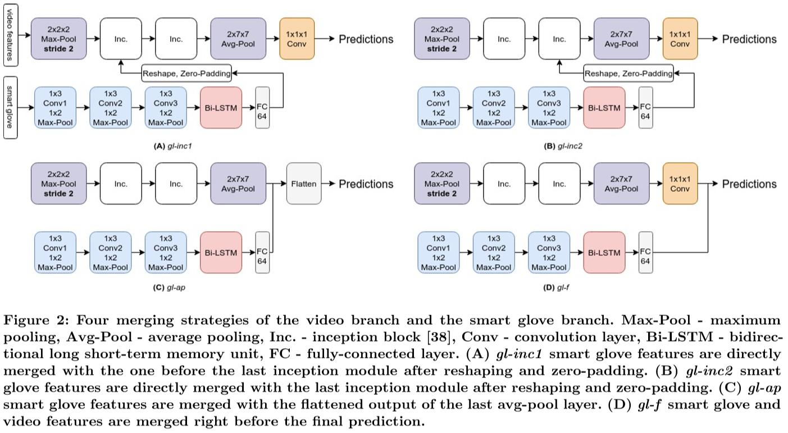
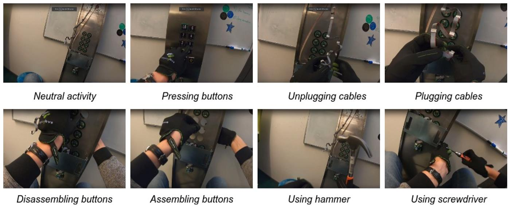

# [ACMMM2019 Draft] Enhancing Accuracy of Deep Action Recognition through Intelligent Fusion of Video and Smart Glove Data
+ 注意：请使用Chrome浏览器并安装Chrome插件'MathJax Plugin for Github'

## 本文目标
融合视频数据和智能手套数据，进行动作的识别(本文为修理电梯过程中的8种动作)。

## 提出的方法
  
其实，只要看图中的(A)即可。我们有两种输入：视频数据和手套数据。对于视频数据，我们用基于3D卷积的InceptionNet(图中简写为Inc.)；对于手套数据，我们使用卷积加Bi-LSTM(双向LSTM)。最后我们需要对这两个过程中的feature map进行融合来进行最终的行为识别(图中的Predictions)。那么如何进行融合呢？作者提出了图中的(A),(B),(C),(D)4种策略，其中的差别在于：在哪个视频过程的模块后加入手套模块的最终特征，从作者的实验结果来看，差别不大，(C)为最优。

## 提出的新数据集
  
作者新构建了一个有8种电梯维修动作的数据集，每个动作包含有视频数据及对应的手套数据。