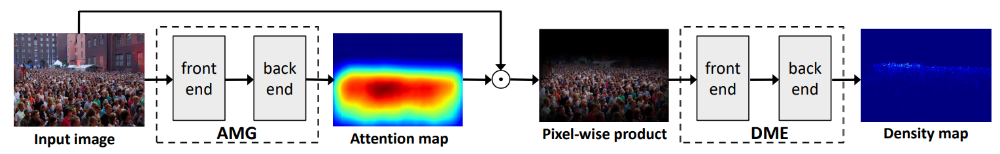
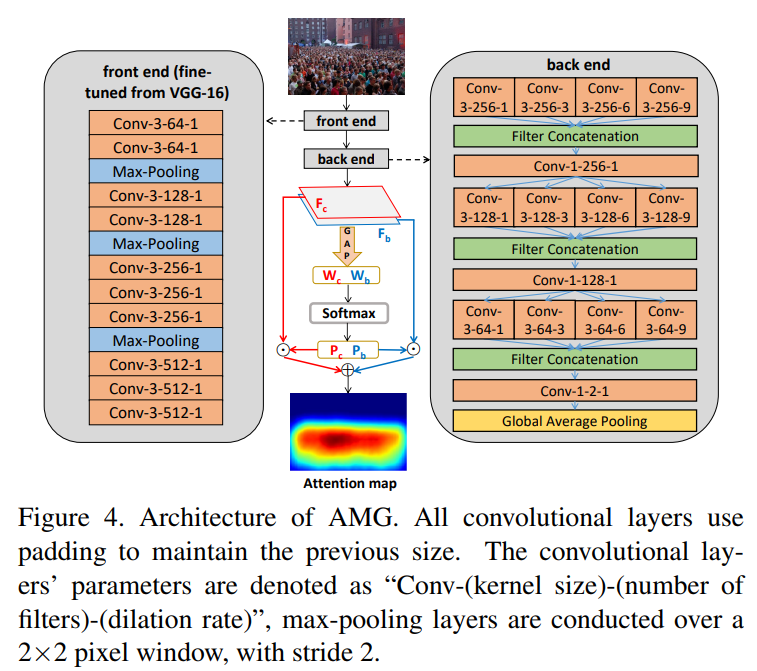
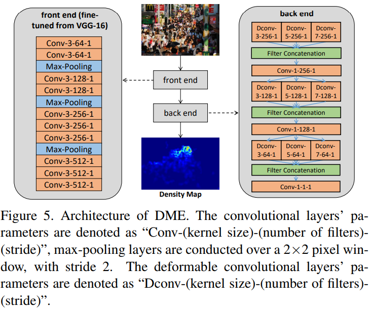

# [CVPR2019] ADCrowdNet: An Attention-Injective Deformable Convolutional Network for Crowd Understanding

## 本文目标
利用注意力来减少噪声背景对于群体计数的影响，提高准确率。

## 方法
网络总体结构与训练流程：  
  
输入图像，然后经过AMG网络得到Attention map。然后把原图和Attention map进行逐元素相乘，得到的结果再输入DME网络得到最终的密度图。整体的训练流程是：先训练AMG，收敛后固定住AMG的参数，再训咯DME。  
这里面我不太理解的一点是Attention map的ground truth是如何生成的？作者文中并没有相关部分。  
然后AMG的具体架构：  
  
里面也没有很多值得说的地方，AMG是一个二分类器，用[0,1]来表示该像素有人or not。  
  
这个里面与之前工作不同的是引入了deformable卷积，能够更好的进行特征提取。  

## 实验结果
ShTechA MAE：63.2 效果OK。(但里面有将attention map做一些阈值处理来得到这个效果，因此在有监督方法里面再继续这个方向做下去的意义可能不大)。

## 其他
希望作者能给出Attention map的ground truth是如何生成的说明。或者我理解错了，AME根本不需要ground truth。