# [CVPR2019] Learning from Synthetic Data for Crowd Counting in the Wild
### [作者开源代码地址](https://gjy3035.github.io/GCC-CL)
+ 注意：请使用Chrome浏览器并安装Chrome插件'MathJax Plugin for Github'
## 本文目标
现有方法的问题：
需要大量准确标注的数据，并且数据的场景要丰富。现有数据集不能满足要求：
  + 不能处理数据集中没见过的情况(变化的天气、光照变化、人数剧烈变化)。
  + 因标注数据有限，模型容易过拟合。在测试集上的效果不好。
  + 一些非常密集的数据集：UCF_CC_50和ShanghaiTech_A,人工标注不是很精确。  

本文从两个方面提出改进方法：
+ 利用游戏Grand Theft Auto V(GTA5)，开发一个数据收集工具和标注工具，并构建一个大型的多样的合成群体计数数据集。(命名为GCC dataset)。该数据集的4点优势：
  + 数据收集和标注方便。
  + 更大的数据量，更高的分辨率。
  + 更多样的场景。
  + 更加准确的标注。  
与之前数据集的详细比较：  
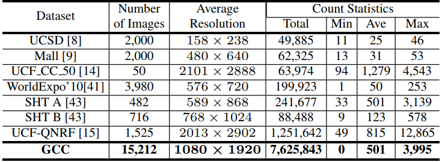

+ 提出了两种利用合成数据来改进群体计数精度的方法。  
  + 提出一种有监督的策略来减少过拟合。具体地：先通过Spatial Fully Convolutional Network(SFCN)预训练合成数据，然后在真实数据上finetune。相对于传统方法采用随机初始化网络参数从零开始训练的做法，我们预训练得到的网络参数更好。  
  + 提出一种domain adaptation(域自适应)的群体计数方法来提高cross-domain(跨域)迁移能力。具体地，提出一种SSIM嵌入(SE)的CycleGAN来有效地将合成场景转换为真实场景。在训练过程中，我们引入了Structural Similarity Index(SSIm) loss。这是衡量原图和重构回来的原图之间差异的一个损失(penalty)。相比原始的CycleGAN，提出的SECycleGAN能够更有效地保持局部模式和纹理信息，尤其在极端拥挤的群体场景。然后我们只用合成数据训练出一个群体计数器，并在真实数据集上进行测试，超越了我们自己的baseline。

总结一下，三方面的贡献：
+ 新的收集工具和标注工具。新的大型合成数据集。
+ 一种预训练策略及一种新的群体计数网络结构SFCN。
+ 一种只用合成数据来训练，并在真实图像进行计数的SECycleGAN。

## GCC数据集的构建
GTA5 Crowd Counting(GCC) Dataset
数据收集：  
+ 场景选择：选取了GTA5中的100个典型的场景，如海滩、体育场、集市、商店等。对于每个场景，使用了4个不同参数的摄像头(位置、高度、旋转/倾斜角度)。最后，我们构建了400个不同的场景。并且精心地在这些场景中选择了能够放置行人的感兴趣区域(ROI)。
+ 行人模型：我们采用了265个行人模型：不同的行人模型有不同的皮肤颜色，性别，形状等等。此外，对于每个行人模型，还有6种额外的外观变化，包括衣服，发型等等。为了增加行人模型的多样性，在稀疏的群体场景中，，每个行人模型还必须做一个随机的动作。  
+ 拥挤群体场景的合成：由于GTA5放置行人模型的数量上限为256，因此，我们使用了step-by-step的方式来合成场景。如下图所示：  
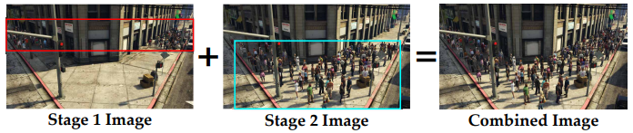  
+ 总体流程：
    + 选择一个场景，启动摄像头
    + 选择人群放置区域ROI
    + 设置天气和时间
    + 在ROI上创建行人模型，得到头部位置
    + 从模板中得到行人掩模
    + 合并多张图像为一张图像
    + 删除被遮挡头部的位置  

GCC的特性：
GCC数据集包含15212张图像，分辨率为1080*1920，包含7625843个行人。与现有数据集相比，GCC是最大的群体计数数据集。GCC包含了400个不同场景。下图展示了部分场景：  
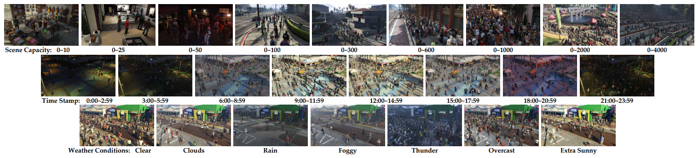 
图中可以看到，我们选取了7种天气状况：clear\clouds\rain\foggy\thunder\overcast\extra sunny。  

## 有监督群体计数模型(SFCN)：
基于全卷积的方法在群体计数领域取得了很好的效果。我们设计了一种有效的空间全卷积网络(SFCN)来直接估计密度图，能够有效地编码全局上下文信息。  
网络结构：使用VGG16或者ResNet101作为骨干网络。  
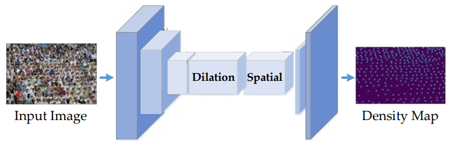   
对于输入的图像，首先通过骨干网络，然后通过spatial encoder(在上下左右四个方向进行卷积)，最后通过regression layer输出密度图。密度图是原图的1/8大小。训练阶段的损失函数是MSE，学习率10的-5次方，使用Adam优化器。  
下表展示了FCN,SFCN和SFCN的配置。表中，'k(3,3)-c256-s1-d2', 表示卷积核为3*3，输出通道为256，步长为1，空洞率为2。  
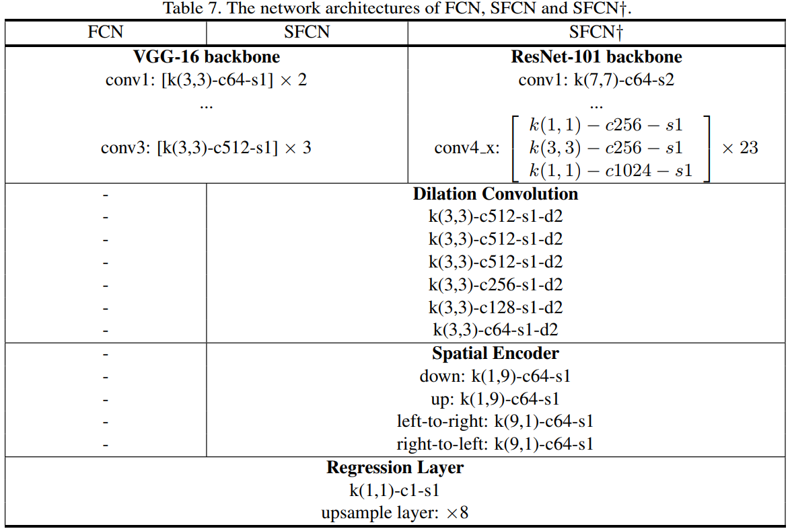 

## GCC实验
做了两类实验：1)在GCC上进行训练和测试。2)在GCC上进行预训练，在真实数据集上进行微调。
+ 仅在GCC上进行训练和测试。从三个方面进行了实验：  
  + 随机划分：整个GCC数据集随机划分为训练集(75%)和测试集(25%)。
  + 跨摄像头的划分：对于一个特定场景，随机选取其中的一个摄像头作为测试，其余摄像头为训练。
  + 跨场景的划分：随机选取75%场景作为训练场景，剩余25%场景作为测试场景。  
  三种评估策略的结果如下：  
  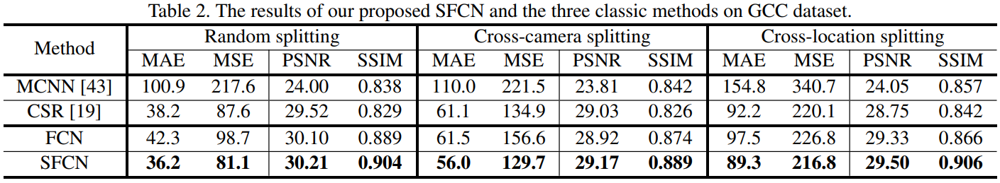  
  更加详细的结果如下：
   
+ 在GCC上进行预训练，在真实数据集上进行微调。  
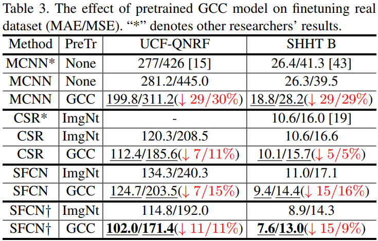   
表3展示了无预训练\ImageNet预训练\GCC预训练的结果差异。可以发现使用GCC预训练的效果最佳。  
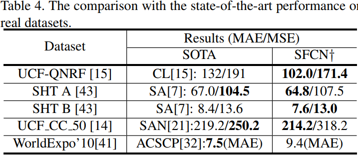
表4展示了利用GCC预训练后在各个数据集上均取得了SOTA的效果。  

## Crowd Counting via Domain Adaptation
上面我们讨论了在合成数据集上预训练，然后在真实数据集上进行微调，来预测真实图像密度图的方法。但是对于极端拥挤场景，人工标注是非常困难的事情。不仅如此，存在着大量不精确的标注。因此，提出一种域自适应的群体计数方法来节省人力，即从合成数据中学到特征，然后直接用来预测真实图像的密度图。这样就不用任何人工标注了。   
但不幸的是，合成数据与真实数据非常不同，比如颜色风格、纹理等等，称为"domain gap"。即使在真实场景，domain gap也很常见。比如ShanghaiTechB和 WorldExpo'10虽然都是真实场景，但非常不同。因此，如何解决domain gap是一个成为Domain Adaptation的问题。  
我们提出了一个SSIM嵌入(SE) CycleGAN来将合成图像转换为真实感图像。然后在这些真实感图像上训练SFCN，并最终用来在真实图像上估计密度图。整个过程无需标注数据。下图展示了整个流程：  
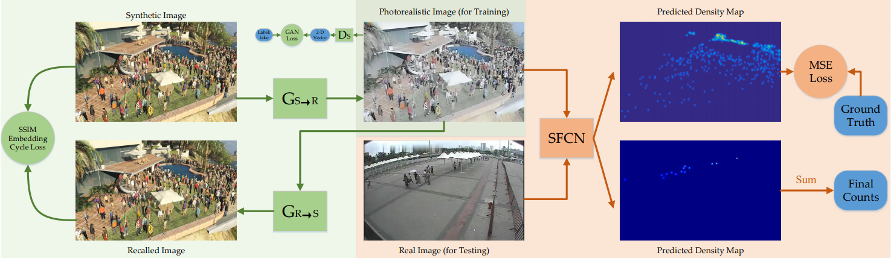  
图中，绿色部分是SE CycleGAN，橙色部分是SFCN。  
SE CycleGAN是在CycleGAN的基础上多加了一项SSIM损失：  
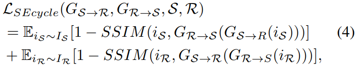
总损失为：  
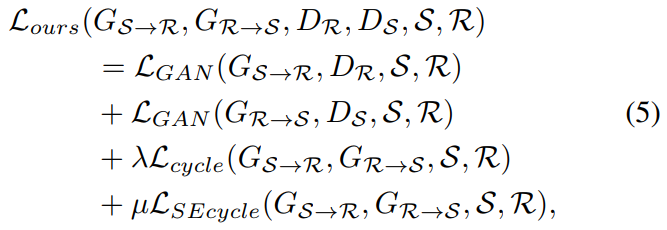  
场景正则化(Density/Scene Regularization)：
+ 在将合成图像转到真实感图像的过程中，一些目标和数据分布是真实场景中所没有的。而且，从理论上讲，密度图中任一像素点的值是属于所有正实数范围的。为了解决这个问题，我们设置了一个上限${MAX}_S$，这个值是合成数据集中最大的密度。如果预测的输出大于该密度，则置为0。注意到网络最后一层是RELU，所以取值范围是大于等于0的。
+ 由于GCC是一个大型和多样的数据集，使用所有图像可能会对域自适应带来副作用。比如，ShanghaiTech不包含打雷/下雨的场景，WorldExpo'10不包含超过500人的场景。因此，在所有合成数据集上训练会降低特定数据集的效果。因此，我们人为地给不同真实数据集设置了一些特定的场景。这是一个粗糙的数据过滤器，而不是一个精细的挑选过程。  

场景正则化的具体配置：  
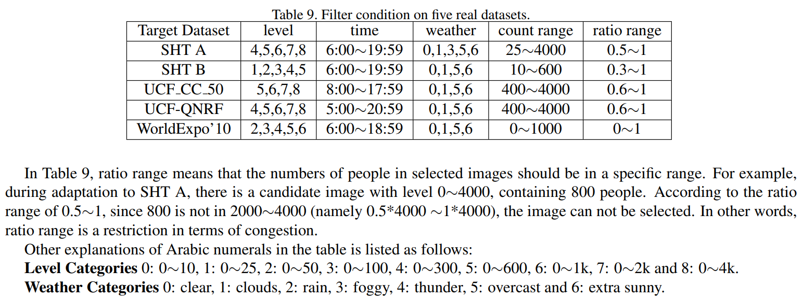 

## Domain Adaptation在真实数据集上的效果
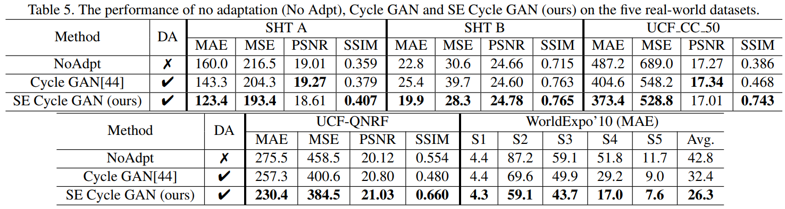   
表6展示了有无DSR情况下的实验结果：  
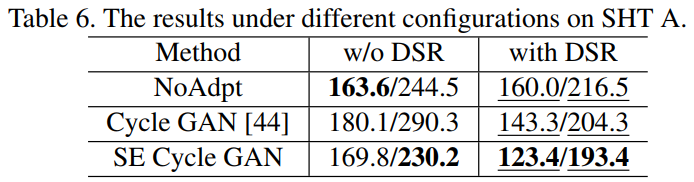  

## 展望
未来会聚焦于通过domain adaptation来进行群体计数，进一步探索如何提取更有效的domain不变的特征。