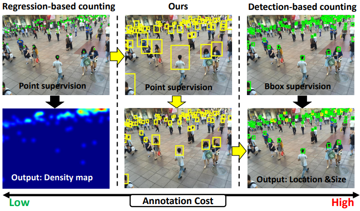
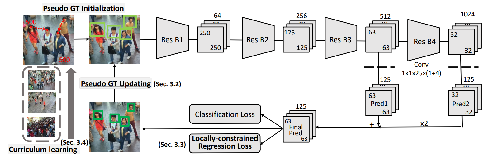
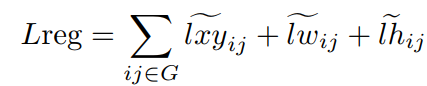
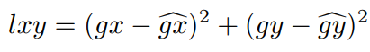
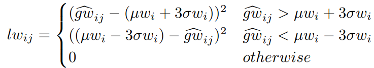
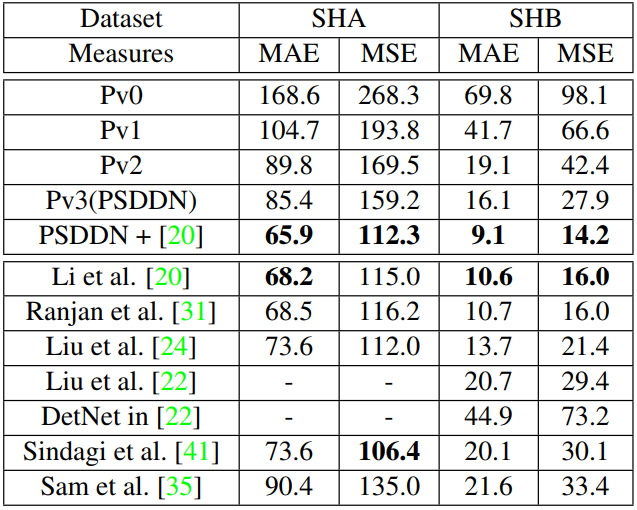

# [CVPR2019] Point in, Box out: Beyond Counting Persons in Crowds

## 本文目标
标注的是人头中心位置点，但能够检测出人头框，如图所示：  
  
图中，左边的是现在主流的群体计数方法，即标注的点，输出的是密度图。中间是本文提出的，标注的是点，然后用k近邻来估计出框的大小，最终通过训练输出准确的人头框。右边的是目标检测主流的方法，即标注的人头框，输出的也是人头框。可以看到，本文方法的主要意义在于：使用标注量较少的方式(头部中心点)来检测人头框。  

## 方法
   
这个网络的基本流程是和主流的目标检测方法RPN和SSD是一样的，即图像经过网络之后输出检测到的人头框，然后与ground truth的人头框计算损失，然后反向传播训练。但从图中我们也可以看到，这篇文章提出了三个新的东西，即伪GT初始化及更新、局部限制的回归损失和课程学习。  
+ 伪GT初始化及更新：  
    初始化：利用K近邻产生初始的人头框，肯定是有误差的，特别是稀疏的地方，如上面第一张图像中间上面的图。  
    更新：对于一个伪GT初始的框，我们从所有小于它的框中选分数最高的框来取代它，如果该框过小，则忽略。  
+ 局部限制的回归损失：  
    这个损失的主要思想是：由于透视效应，相同高度的人头框也应该差不多。  
    因此，这个损失的定义如下：  
      
    其中，  
      
    代表的是预测的框中心与真实的框中心的损失。  
      
    代表的是某个高度上框的宽度应该是在3sigma范围内的。 
    同样的，我们定义某个高度上框的高度应该也是在3sigma范围内的。这样这个局部限制的回归损失就讲完了。  
+ 课程学习：  
    这个概念是Bengio在09年提出来的，意思上机器学习应该和我们上课一样，从易到难。因此这篇文章采用了这个课程学习的策略。  
    在计数的过程中，我们发现中等大小的人头框是最准的，因此从其开始训练，然后再是中等偏小的框，最后才是大框。 

## 实验结果
 