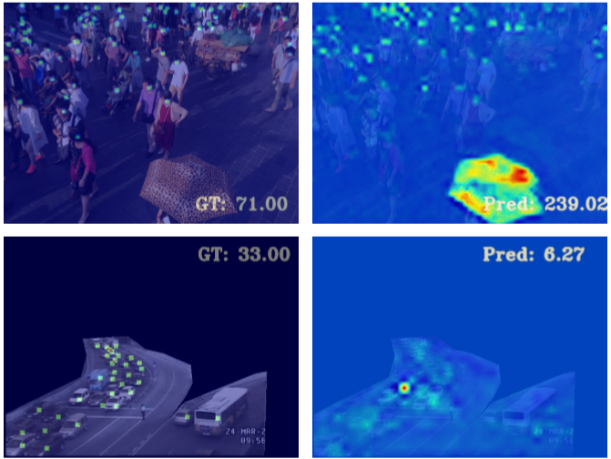
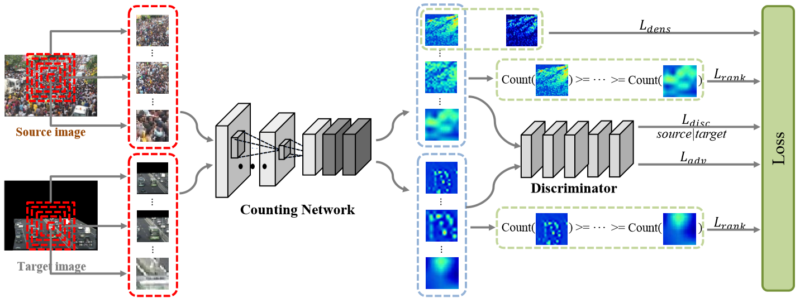
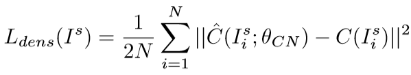
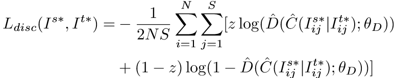
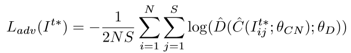
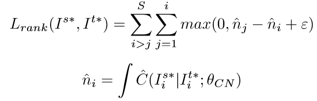
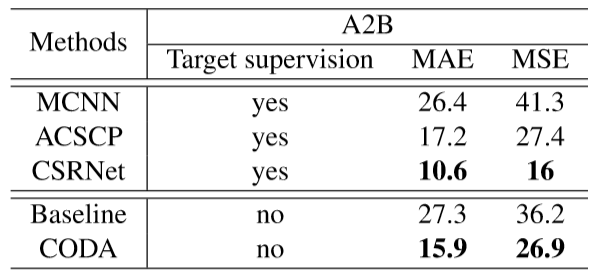

# [ICME2019] CODA: Counting Objects via Scale-Aware Adversarial Density Adaption
### [作者开源代码地址](https://github.com/Willy0919/CODA)
+ 注意：请使用Chrome浏览器并安装Chrome插件'MathJax Plugin for Github'
## 背景
现有群体计数模型，对训练集中见过的图像计数效果很好，但是对于没见过的图像效果下降就很明显了。下图是两个失败情况：  
  
上面的是人群计数，下面是车计数。  

## 启示
虽然计数对象在外观上变化多样，但是我们所期望得到的密度图是相似的，即：密集区域拥有较高的值；忽略背景区域。

## 方法
  

总体来说：两阶段方法，先监督学习，再域自适应。  
说明：$I^t$代表目标域图像，$I^s$代表原域图像。相对的，$I^{t*}$代表目标域金字塔块图像，$I^{s*}$代表原域金字塔块图像。  

+ Counting Network 计数网络(记作CN)  
结构：CSRNet(最后两层空洞率设为4)  
损失函数为：  
  
注意：这里只对原数据集进行有监督训练。  

+ Density Adaption 密度自适应  
这里我们需要复用上面的CN。对于目标域图像，我们使用CN可以得到预测的密度图。  
然后我们引入了判别器Discriminator，用来判断当前密度图是由源域图像产生的还是目标域图像产生的。  
判别器结构：五层卷积(步幅=2，卷积核尺寸=4*4)，通道数分别为{64，128，256，512，1}  
损失函数：  
  
其中，z=0代表当前密度图属于目标域图像产生的，z=1代表当前密度图属于源域图像产生的。

+ Scale-aware Adversarial Learning  
顾名思义，多尺度，即上图中左边以中心点扩张出去的若干个不同大小的红色矩形块，并且作者同样借鉴使用了ranking-loss。
  
  

训练过程：将CN看作生成器，Discriminator作为判别器。然后对抗训练即可。

## 实验结果
选取了论文中代表性的实验。(ShanghaiTech AtoB)
  
可以看到：这种半监督的方法效果与全监督的方法相比是还行的。Amazing!