# [CVPR2019] Geometry-Aware Symmetric Domain Adaptation for Monocular Depth Estimation
### [作者开源代码地址](https://github.com/sshan-zhao/GASDA)
## 本文目标
利用合成数据(合成图像及其ground truth深度图)训练模型，并使用该模型在真实图像上进行深度估计。下图是真实图像和合成图像及对应深度图的展示：  
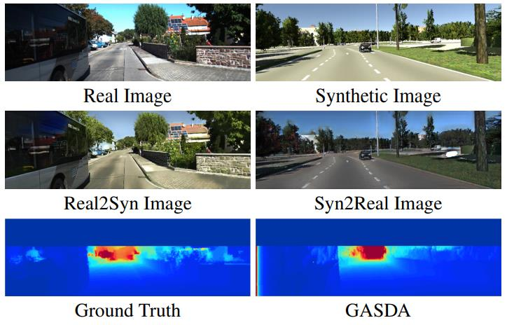

## 提出的方法
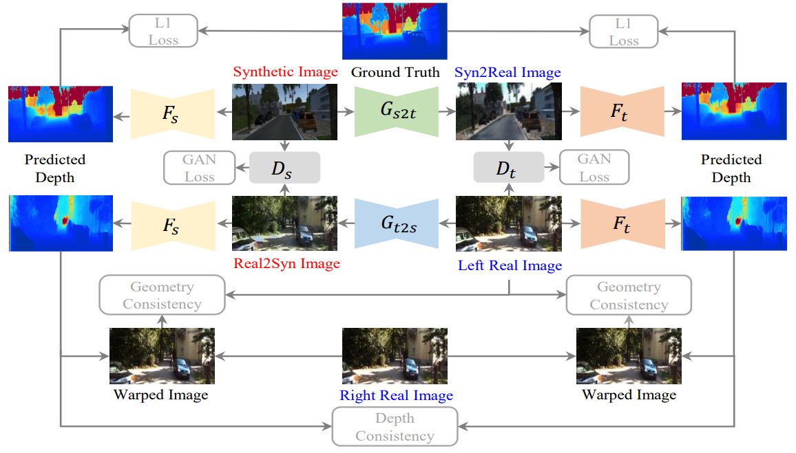  
从整个网络看，可以分为两部分：  
+ 风格迁移部分：合成图转真实图的生成器$G_{s2t}$,真实图转合成图的生成器$G_{t2s}$,判别是否为合成图的判别器$D_{s}$,判别是否为真实图的判别器$D_{t}$
+ 深度估计部分：合成图的密度估计器$F_s$,真实图的密度估计器$F_t$  

然后是多种损失函数分别用于度量不同的指标： 
+ 风格迁移部分用到的损失：
  + adversarial loss，用于度量图像的质量、真假：  
  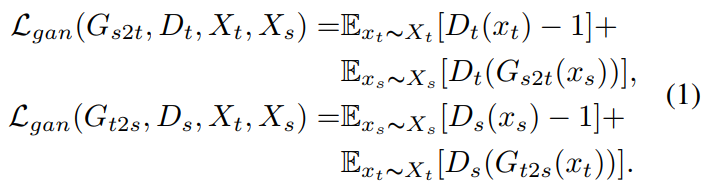
  + cycle consistency loss，用于保持循环一致性：  
  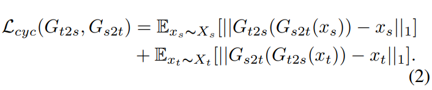  
  + identity loss，用于保证生成器不会转换不属于源域的图像：  
  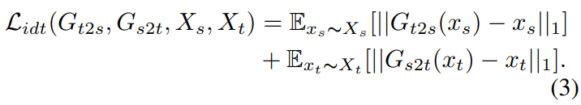  
  + 总的损失：
  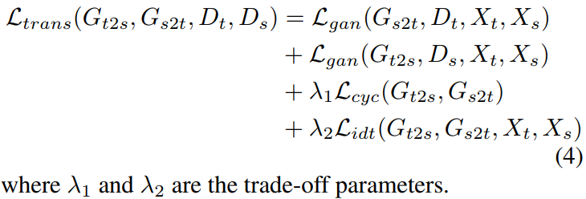  
+ 深度估计部分用到的损失：
  + L1 loss，用于衡量预测的深度图和ground truth深度图之间的差异：
  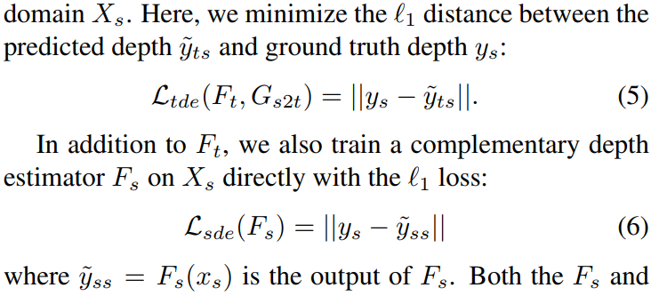  
  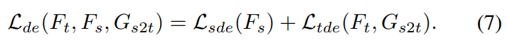 
  + Geometry Consistency Loss，几何一致性损失，用于衡量左视图根据对极几何映射得到的图像与右视图之间的差异：  
  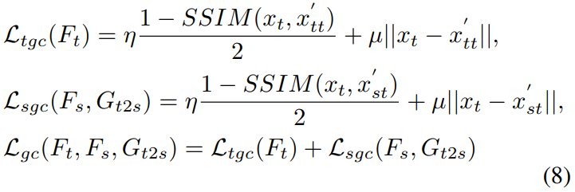
  + Depth Smoothness loss，保持局部同质区域的连续性：  
  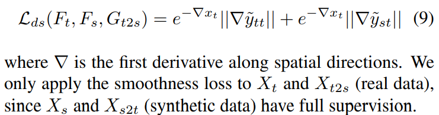 
  + Depth Consistency loss，保持真实图和合成图预测出的深度图一致：
  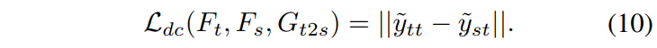  
  + Full Objective，总的目标函数：
  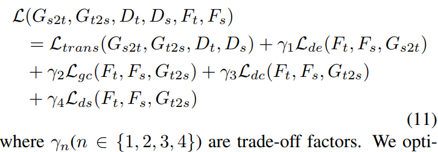

深度图最终的预测过程：  
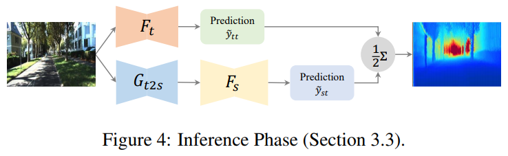
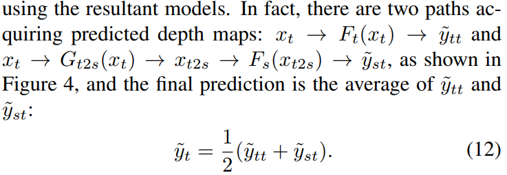  

训练细节：  
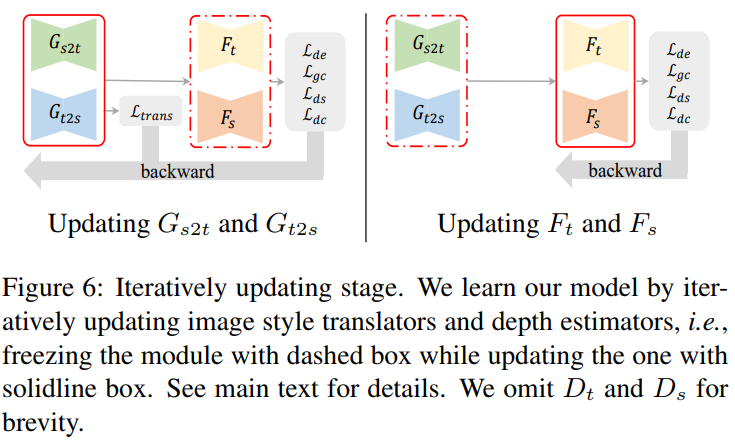