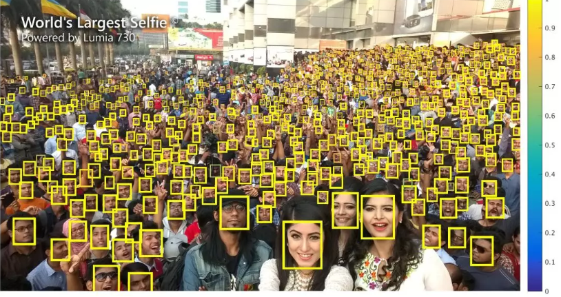

# Finding Tiny Faces
[[论文链接]](https://www.cs.cmu.edu/~peiyunh/tiny/) [[代码]](https://github.com/peiyunh/tiny)

## 效果
  
令人惊艳的效果！

## 内容
该文主要对小人脸的识别上，主要从三个方面来考虑：尺度不变性，图像分辨率和上下文推理。 
在这片文章中也得到了三个结论：
1. 由于小目标的信息太少，因此需要使用小目标的周围信息来扩充小目标的感受野，即利用人脸周围的头发，耳朵，肩膀等信息。
2. 对于小人脸，不是越大的感受野得到的结果越好，对于大人脸，更大的感受野对提升效果不明显。
3. 不同大小的特征图的融合是检测小人脸的关键，但是对于大人脸效果不明显。 