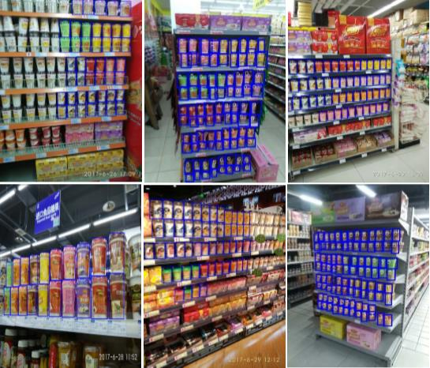
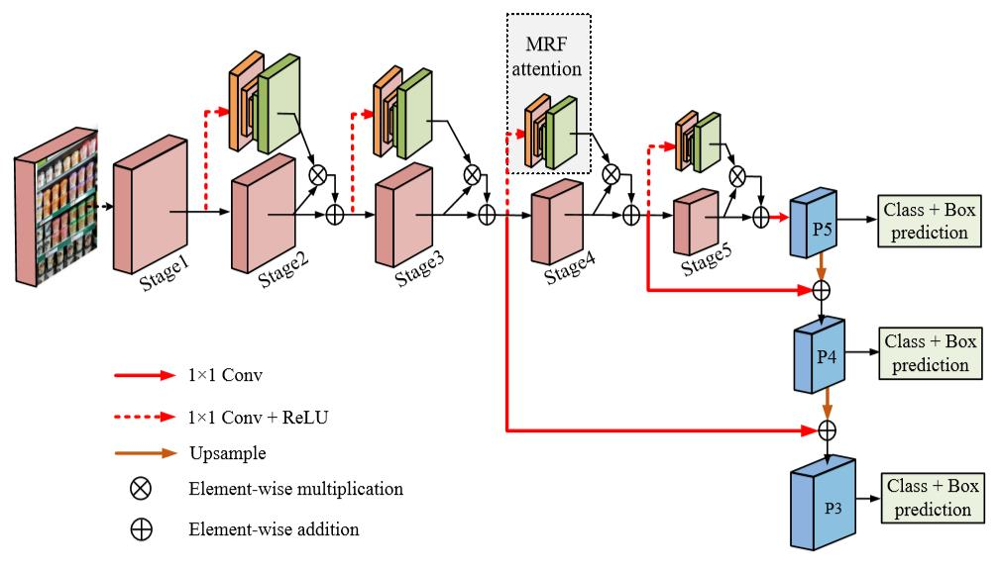
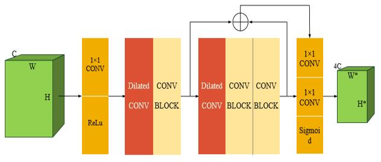

# [ACMMM2019 Draft] Small and Dense Commodity Object Detection with Multi-Receptive Field Attention
+ 注意：请使用Chrome浏览器并安装Chrome插件'MathJax Plugin for Github'

## 本文目标
给一张超市货架图像，然后自动识别出其中的商品。如下图所示：  

## 提出的方法
  
与RetinaNet类似，本文的CommodityNet也是一个one-stage的方法。  
从图中可以看到，整个模型可以分为两部分：  
+ MRF attention(多接受域注意力)： 
上图中的虚线框MRF attention的详细结构如下图所示：   
  
使用了空洞卷积来替代池化层导致的信息损失。  

+ 基础结构：  
分为5个stage，是由ResNet切成5份得到的，然后在stage2-5加入MRF attention。  

损失函数的改进：  
+ 传统交叉熵损失：${L_{CE}}=-(y{\cdot}log(p)+(1-y){\cdot}log(1-p))$