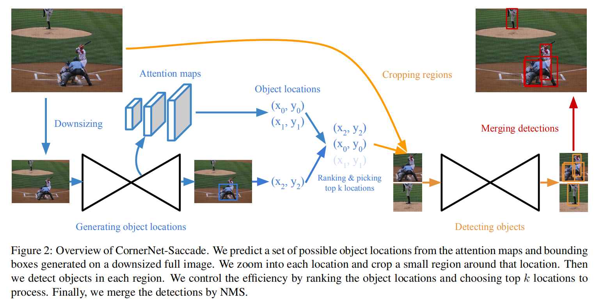

# CornerNet-Lite: Efficient Keypoint Based Object Detection (Arxiv2019)

## 动机
提高CornerNet的检测效率

## 内容
两方面的改进：
+ CornerNet-Saccade：利用attention机制减少需要检测的像素点数量。
+ CornerNet-Squeeze：受到SqueezeNet及MobileNet的启发，减小对每个像素点的操作。

