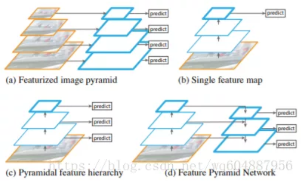

# Feature pyramid networks for object detection (CVPR2017) (FPN)
[[论文链接]](https://arxiv.org/abs/1612.03144)

## 内容
这是cvpr2017年出的一篇文章，该文主要是针对通用目标的检测方法，但是在小目标检测中起到了关键作用，以至于之后的很多小目标检测方法都用到了类似的该方法，如faster-rcnn+fpn，yolo3中的特征融合。  
该文的主要思想：在fpn之前目标检测的大多数方法都是和分类一样，使用顶层的特征来进行处理。但是这种方法只是用到了高层的语义信息，但是位置信息却没有得到，尤其在检测目标的过程中，位置信息是特别重要的，而位置信息又是主要在网络的低层（换种说法：低层的特征语义信息比较少，但是目标位置准确，高层的特征语义信息比较丰富，但是目标的位置粗略）。因此在这片文章中采用了多尺度特征融合的方式，采用不同特征层特征融合之后的结果来做预测。  
  
该图非常形象的说明了fpn和其他特征融合方式的区别。(a)图是典型的图像金字塔形象，该方法主要是将图像生成不同的尺寸，在每一个尺寸上生成对应的特征图，再在对应的特征图上做相应的预测。这种方法所需要占用的内存和时间比较大，因此没有多少算法使用该方法。在(b)中，在最经典的目标检测方法，只在最后一层的特征图上做预测，常见的rcnn,faster-rcnn都是这种方法。图(c)中是使用了多层的特征图，每一个特征图来做一个新的预测，典型的是ssd中使用的方法。(d)中即使使用fpn的方法，它在图(c)的基础上得到每一层的特征图，之后采用自顶向下的方法将小的特征图上采样之后与下一个特征图融合，融合之后再做预测，依次如此，即可得到多个预测结果。  
该方法与faster-rcnn，ssd结合，通过融合高层的语义信息和低层的位置信息，预测在不同的特征图上进行。在测试结果上的结果是令人喜悦的，尤其在小目标检测的提升是比较明显的。