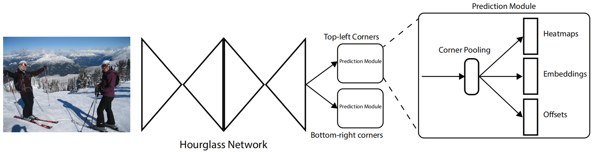

# (ECCV2018) CornerNet: Detecting Objects as Paired Keypoints
[[论文链接]](https://arxiv.org/abs/1808.01244)
[[代码]](https://github.com/umich-vl/CornerNet)

## 摘要
本文提出了一种新的目标检测方法，使用单个卷积神经网络将目标边界框检测为一对关键点（即边界框的左上角和右下角）。通过将目标检测为成对关键点，我们消除了现有的one stage检测器设计中对一组anchors的需要。除了上述新颖的构想，文章还引入了corner pooling，这是一种新型的池化层，可以帮助网络更好地定位边界框的角点。CornerNet在MS COCO上实现了42.1％的AP，优于所有现有的one stage检测器。

## 动机
现有one-stage的目标检测方法都采用anchor box(它们是包含各种尺寸和宽高比的矩形框，是用作检测的候选框)。one-stage检测器将anchor boxes密集地分布在图像上，通过对anchor boxes进行评分，并通过回归来改进其坐标来生成最终的边界框预测。  
但是anchor boxes的使用有两个缺点：
+ 训练需要的anchor boxes非常多，在DSSD中超过4万，在RetinaNet中超过10万。这是因为训练器被训练以分类每个anchor boxes是否与ground truth充分重叠，并且需要大量anchor boxes以确保与大多数ground truth充分重叠。 结果，只有一小部分anchor boxes与ground truth重叠; 这在正负样本之间造成了巨大的不平衡，减慢了训练速度。
+ anchor boxes的使用引入了许多超参数和设计选择。 这些包括多少个box，大小和宽高比。 这些选择主要是通过ad-hoc启发式方法进行的，并且当与多尺度架构相结合时可能会变得更加复杂，其中单个网络在多个分辨率下进行单独预测，每个尺度使用不同的特征和它自己的一组anchor boxes。

## 提出的方法
+ 整体方法概述
  
上图是CornerNet的概述。使用Hourglass Network作为骨干网络，之后是两个预测模块，一个用于左上角，另一个用于右下角。每个模块都有自己的corner pooling模块，在预测热图、嵌入和偏移之前，池化来自沙漏网络的特征。
+ 检测角点
+ 分组角点
+ Corner Pooling
+ Hourglass Network

## 参考
更详细的参考：[[CSDN]](https://blog.csdn.net/weixin_40414267/article/details/82379793)