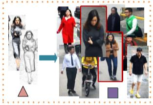
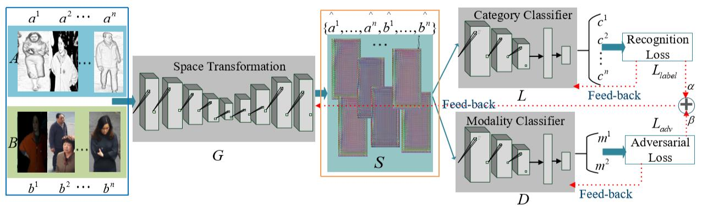
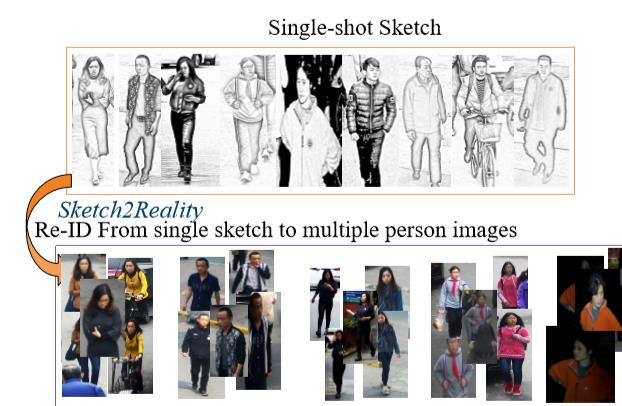

# [ACMMM2019 Draft] A Modality Invariant Adversarial Network: Person Re-Identification From Virtuality to Reality
+ 注意：请使用Chrome浏览器并安装Chrome插件'MathJax Plugin for Github'

## 本文目标
给一张行人的素描图像，然后我们可以判断在其他摄像头拍到的行人是否为该行人。如下图所示：  
  

## 提出的方法
  
在上述图像中，输入A是素描图像，输入B是真实图像。在每个batch中，我们随机挑选了n张素描图像$a^1,a^2,...,a^n$和n张真实图像$b^1,b^2,...,b^n$(其中$a^i$和$b^i$不需要是对应的)。然后我们使用一个生成器G(由一个9层ResNet构成)来将$a^1,a^2,...,a^n$ 和 $b^1,b^2,...,b^n$ 转换成 ${\hat{a^1}},{\hat{a^2}},...,{\hat{a^n}},{\hat{b^1}},{\hat{b^2}},...,{\hat{b^n}}$.  
通过G，我们认为${\hat{a^1}},{\hat{a^2}},...,{\hat{a^n}}$和${\hat{b^1}},{\hat{b^2}},...,{\hat{b^n}}$已经被映射到同一个语义空间(比如可以进行语义上的度量)。  
然后我们使用两种损失函数来指导反向传播。  
一种是识别损失$L_{label}$，具体来说是用$c^1,c^2,...,c^n$和对应的真实标签构成的交叉熵损失，度量的是行人的类别。  
另一个则是生成损失$L_{adv}$，具体来说是用$m^1,m^2$和对应的真实标签构成的交叉熵损失，度量的是输入的模态(素描还是真实图像)。
$$ {L_{adv}}={-{\frac{1}{n}}}{\sum_{i=1}^n}{({m^i_a}{\cdot}{logD}{({\hat{a^i}}{;}{{\theta}_D})}{+}{({m^i_b}{\cdot}{log}{(1-D)}{({\hat{b^i}}{;}{{\theta}_D})})})}$$  
最后，我们用end-to-end的方式来训练这个网络。

## 两种数据增强的策略
+ 不同行人类别之间样本数量不平衡问题：  
先找到最大样本数量$p$的类别，然后采用拷贝原图像的方式来填充其他类别，直到数量为$p$。
+ 风格转换:  
使用CycleGAN将真实图像转换成素描图像。

## 提出的新数据集
论文使用 '美图秀秀' 软件来构造数据集。使用到的是'美图秀秀'软件里的真实图像转素描图像的功能。数据集部分展示如下：  
  

