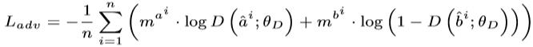

# [ACMMM2019 Draft] A Modality Invariant Adversarial Network: Person Re-Identification From Virtuality to Reality
note: please use Chrome plugin 'MathJax Plugin for Github' in Chrome Web browser to avoid the error visualization of equation.

## Purpose of the papar
Given one person's sketch, then we can re-id this person in other cameras. As shown in the following picture:  
  

## Proposed Method
  
In above figure, the input A is the sketch-style-image and B is the real-image. In each batch, we randomly select n sketch $a^1,a^2,...,a^n$ and n real images $b^1,b^2,...,b^n$($a^i$ is not opposite to $b^i$). Then we use a generator G(composed of 9 layers ResNet) to convert $a^1,a^2,...,a^n$ and $b^1,b^2,...,b^n$ to ${\hat{a^1}},{\hat{a^2}},...,{\hat{a^n}},{\hat{b^1}},{\hat{b^2}},...,{\hat{b^n}}$.  
Through G, we think that ${\hat{a^1}},{\hat{a^2}},...,{\hat{a^n}}$ are in the same space with ${\hat{b^1}},{\hat{b^2}},...,{\hat{b^n}}$ which means they have semantic information in same space and can compare with each other(such as distance metric).   
Then we use two loss to constrain the Back-propagation.  
One is the recognition loss $L_{label}$, which is a cross-entropy function of $c^1,c^2,...,c^n$ with its ground-truth labels.
The other is the adversarial loss $L_{adv}$.  
 
<!--$$L_{adv}=-{\frac 1 n} \sum_{i=1}^n ({m_a^i}\cdot log{D({\hat{a}^i;{\theta}_D})}+{m_b^i}\cdot log(1-D({\hat{b}^i;{\theta}_D})))$$  
And the whole loss is $L_G={\alpha}L_{class}+(-{\beta}L_{adv})$.-->
Finally, we can train this neural network in the manner of end-to-end.

## Two Data Augmentation way
+ Unbalance num of samples in different categories:  
we find the max number $p$ to set the target expanded number, then make up the insufficient sequence of certain pedestrians by copying the original images. 
+ Style Transformation:  
use CycleGAN to transfer the real image to sketch-style-image.

## Proposed New Dataset
Paper use 'MeituXiuXiu' software to construct the dataset.  
 
