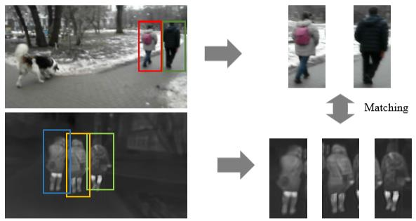
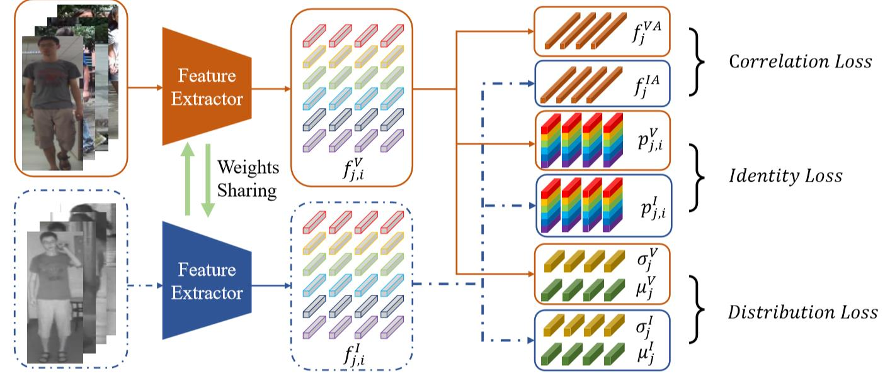
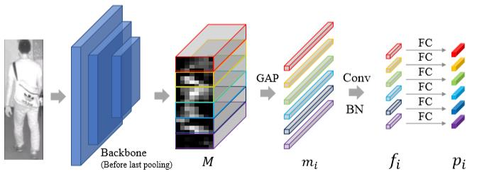
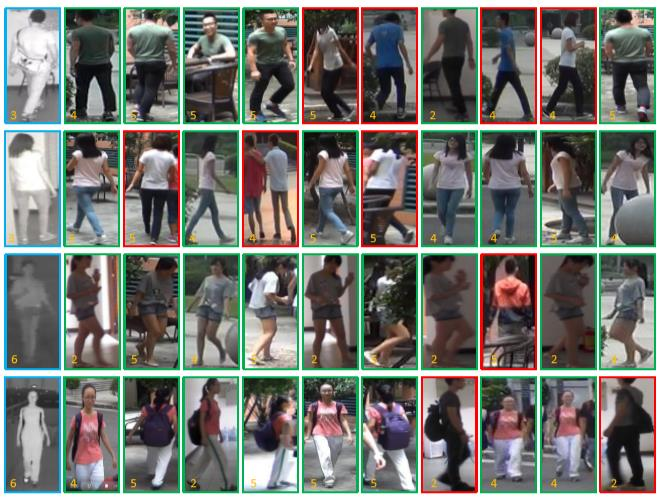

# [ACMMM2019 Draft] Dual-alignment Feature Embedding for Cross-modality Person Re-identification 
+ 注意：请使用Chrome浏览器并安装Chrome插件'MathJax Plugin for Github'

## 本文目标
如何进行弱光照条件下的Re-id？  
即如何利用RGB图像和红外图像进行多模态的Re-id？  

## 提出的方法
  
上图是整个网络的结构，希望先通过一个特征提取器(Feature Extractor)来使得RGB图像和红外图像都能转换到相同语义的空间。特征提取器的结构如下图所示：  

特征提取器以ResNet-50作为骨干架构的。
然后文章提出了两个损失函数：
+ Distribution loss：L2 Norm(Jensen-Shannon divergence)
+ Correlation loss: L2 Norm(Pearson Correlation matrix)

## 数据集
+ RegDB dataset.
+ SYSU-MM01 dataset.
  
上图展示的是Top-10结果，绿色边框代表预测正确，红色边框代表预测错误。  
