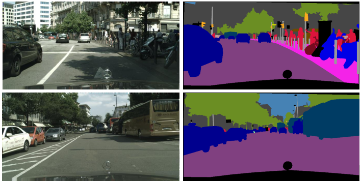
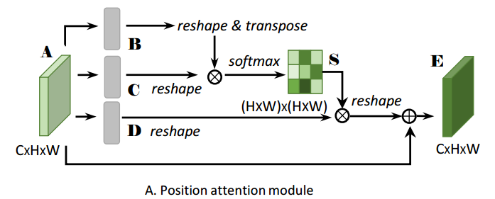
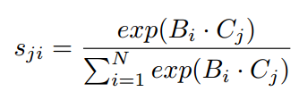
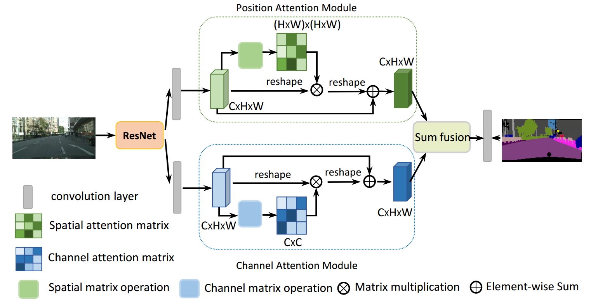

# [CVPR2019] Dual Attention Network for Scene Segmentation
### [作者开源代码地址](https://github.com/junfu1115/DANet)
+ 注意：请使用Chrome浏览器并安装Chrome插件'MathJax Plugin for Github'
## 本文目标

针对复杂和多样化的场景，能进行更好的语义分割。
如上图所示：一些人和交通灯由于光照和视角的缘故分割得不好。
因此，本文使用自注意力机制来解决这一问题。

## 提出的方法
位置自注意力：有相同语义的物体或目标应该有相似的特征，因此我们对不同位置之间的像素值进行了相似度的比对。模块图如下：  
  
最精髓的公式在于相似度度量这个公式：  
   
该公式的含义是：如果这两个像素点的值差不多，那么它们会被分为同一类。  
同样地：作者提出了另一个通道自注意力来和位置自注意力形成对偶关系。  
  
因此，整个网络如下：  
   

## 收获
这篇文章最出彩的部分，我认为是像素点自注意力。提出了一个能够嵌入神经网络的相似性度量方式，能够在网络内部把相同语义的像素点找出来，改善语义分割的性能。