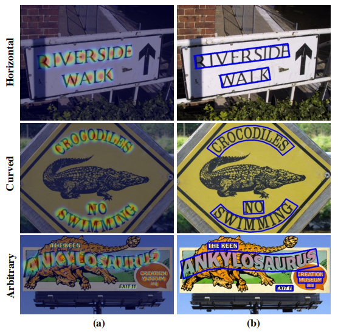
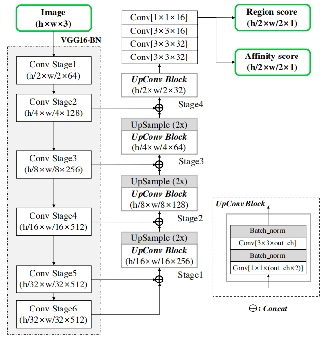
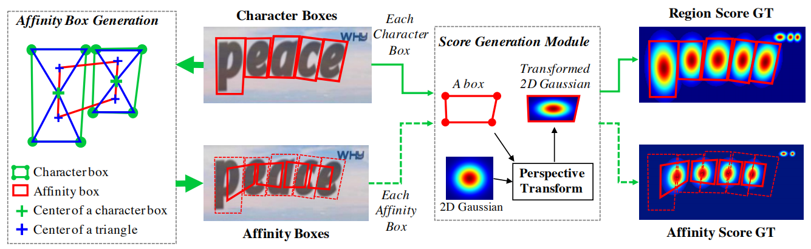
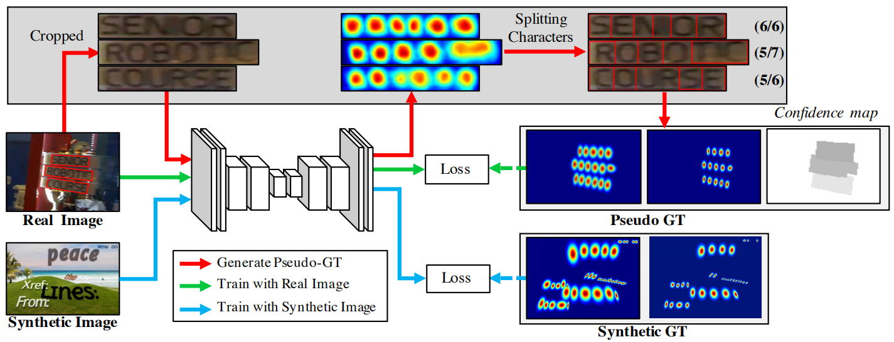
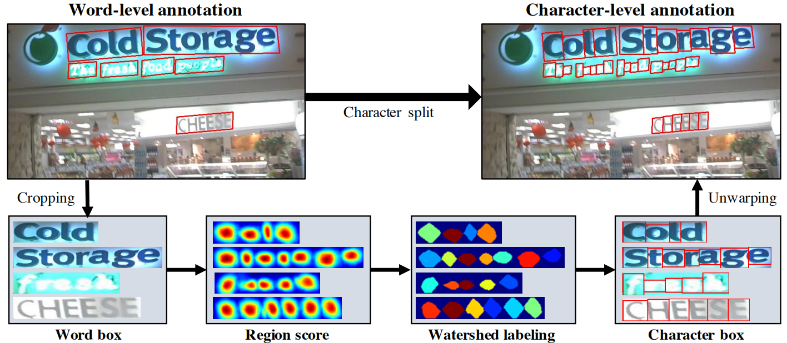
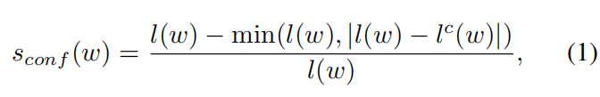
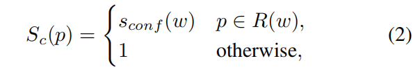
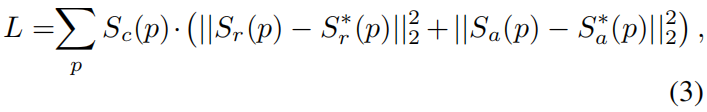
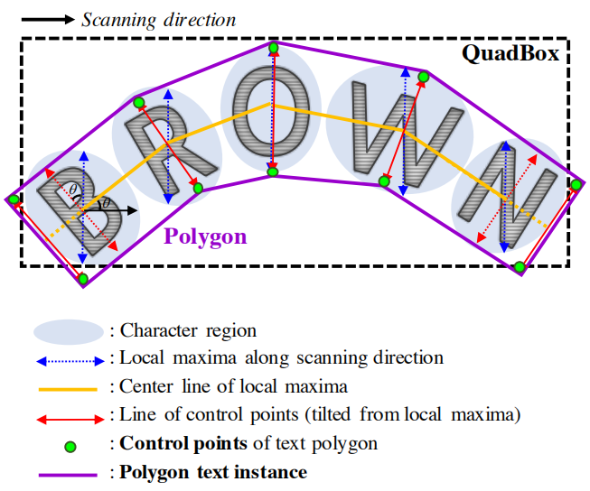

# Character Region Awareness for Text Detection  
[[论文链接]](https://arxiv.org/abs/1904.01941) 
[[代码]](https://github.com/clovaai/CRAFT-pytorch)  
目前代码中有测试代码及训练好的模型，但还没有训练部分的代码。

## 效果

## 动机
基于神经网络的文本检测方法已经展现出了强大的能力，但之前的方法受限于word-level边界框，不能很好地识别任意形状的文本。因此本文提出了一种character-level的新方法来解决这一问题。  
  
图中展示了水平，曲线，任意三种类型的文本，图中(a)展示的是字符级别的网络输出结果，(b)展示的是检测结果。

## 相关工作
初看该领域的文章，介绍一下相关工作：  
+ Regression-based text detectors：将通用目标检测方法运用到文本检测中。此类方法包括：TextBoxes、DMPNet等。
+ Segmentation-based text detectors：将文本检测作为语义分割任务来处理。此类方法包括：Multi-scale FCN、SSTD等。  
+ End-to-end text detectors：将文本检测和识别一起处理的方法，包括：FOTS、EAA等。
+ Character-level text detectors：相对比较经典的方法，包括：MSER、Mask TextSpotter等。  
这篇文章受到WordSup启发——利用若监督框架来训练字符级别的检测器。

## 方法

1. 整体的网络结构：  
      
    从网络结构中我们可以看到，输入是一幅 h * w * 3 的图像，输出是 h/2 * w/2 * 2的语义图，具体而言，输出的2个通道分别代表了Region score和Affinity score。网络类似UNet，使用VGG16作为backbone。
    + Region score：给定像素是字符中心的概率。
    + Affinity score：给定像素是相邻两字符中心的概率。  

    因此，该模型就是一个end-to-end回归模型，下一步就是怎么生成ground truth的Region score和Affinity score用来进行训练。
2. ground truth的生成
    注：此处ground truth的生成需要character-level的标注，由于只有合成数据集才有这样的标注，所以这里用的是合成数据集。
      
    上图展示了ground truth的生成过程：
    + 这幅图从Character Boxes开始看=>往右绿色实线箭头=>对于每个box，用一个透视变换的二维高斯核来填充=>往右绿色实线箭头=>Region Score GT
    + 这幅图从Character Boxes开始看=>往左绿色粗箭头=>计算相邻两个字符框之间的Affinity Box，即先算出每个字符的中心(绿色十字点)，然后计算Affinity Box的四个顶点(蓝色三角形的蓝色十字点)=>往右绿色粗箭头=>得到Affinity Boxes=>往右绿色虚线箭头=>对于每个box，用一个透视变换的二维高斯核来填充=>往右绿色虚线箭头=>Affinity Score GT  

    然后我们就可以用图像和对应的ground truth训练模型了。  
    可以发现，使用这样的ground truth之后，哪怕使用小接受域，检测大的或者长的文本的效果也很好，而之前的word-level的方式在遇到这种情况时需要增大接受域。
3. 弱监督学习
    我们已经合成数据集上预训练了模型，但我们要应用到真实场景中，但真实场景数据集没有character-level的标注，所以，我们为了在真实数据集上微调模型，使用了弱监督学习。具体过程如下：  
      
    图中共有三种颜色的分支：
    + 蓝色：使用合成数据集训练得到预训练模型。
    + 红色：用于生成真实图像的伪GT
    + 绿色：利用伪GT微调模型  

    蓝色的就不用多说了，现在唯一还没说的就是Loss是什么了，这个待会和绿色Loss一起说，因为差不多。重点来说说红色和绿色部分。  
    + 红色部分：生成真实图像伪GT的过程如下：  
      
    首先从图像中裁剪出word box，然后输入预训练模型得到Region score，接着用分水岭算法分割每个字符位置得到Character box，最后再把分割结果映射回原来图像中的位置，即为伪GT。
    + 绿色部分：由于是弱监督学习，生成的伪GT不一定是正确的，因此我们需要一些线索来保证伪GT的质量，所以利用了word length(单词中字符的个数)作为一个很强的约束，并以此来构建confidence map来构建一个用于训练的Loss。具体的公式推导如下：  
        对于裁剪出的单词框w，R(w)表示单词框区域，l(w)表示word length(单词中字符的个数)。通过红色部分，我们能够得到伪的单词长度$l^c(w)$。然后我们定义了置信分数$s_{conf}(w)$：  
          
        这个公式容易理解，伪单词长度与真实单词长度差异越小，置信分越高。然后将属于R(w)内的像素点的置信分都设置成$s_{conf}(w)$，如公式2所示：  
          
        p代表像素点，得到的$S_c{p}$就是confidence map。  
        然后，Loss就可以定义为：  
          
        $S_r(p)$表示伪region score map，$S_a(p)$表示伪affinity map。从公式中，我们看出confidence map起到的是权重的作用，越真的伪GT越值得用于微调。  
        对于合成数据集训练的Loss，我们直接设置$S_c{p}$为1
4. 推断  
    在Inference阶段，我们要做的就是如何利用Region score map和affinity score map来生成单词框。  
    文章中给出了两种方式：一种是生成矩形框，另一种是生成多边形框。  
      
    + 生成矩形框：  
        1. 初始二值图M(与原图尺寸一致)为0。如果$S_r{p}$>$t_r$或者$S_a{p}$>$t_a$，(其中$t_r$和$t_a$分别是region和affinity分数的阈值)，那么M(p)设置为1。
        2. 在M上使用Connected Component Labeling(CCL)。有Opencv的函数可以使用：connectedComponents
        3. 找到最小外接矩形。有Opencv的函数可以使用：minAreaRect  

        注意到我们不需要进一步的后处理操作：如非极大值抑制等，这是本文方法的一大优势。  
    + 生成多边形框：
        1. 沿着Scanning direction方向，找出局部最长垂直直线(蓝色虚线)。然后将每条直线的长度都统一设置成它们的最大长度。
        2. 取每条局部最长垂直直线的中心，连接起来，得到黄色的中心线。
        3. 将每条局部最长垂直直线旋转某个角度，得到红色的线。
        4. 将最外侧的两条红线往外延申，然后将所有绿色点相连接即为多边形框。  
        注：旋转角度具体怎么旋转文中未说明，留待在作者的代码中探索。  

## 数据集
+ ICDAR2013
+ ICDAR2015
+ ICDAR2017
+ MSRA-TD500
+ TotalText
+ CTW-1500

## 训练细节
1. 使用合成数据集先训练50k次迭代
2. 使用每个真实数据集进行微调
3. 使用ADAM优化器
4. 微调过程中，以1：5的频率再次使用合成数据集训练来保持字符能分开
5. 为了能够识别出真实场景中的文本，On-line Hard Negative Mining以1：3的频率使用
6. 基本的数据增强技术：裁剪、旋转、颜色变换
