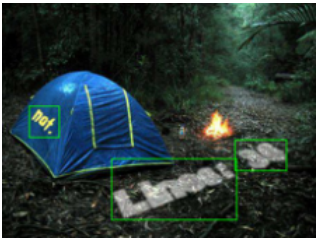

# What is wrong with scene text recognition model comparisons? dataset and model analysis  
[[论文链接]](https://arxiv.org/abs/1904.01906) 
[[代码]](https://github.com/clovaai/deep-text-recognition-benchmark)  
注意：请使用Chrome浏览器阅读，并安装mathjaxforgithub插件。

## 摘要
近年来提出了很多新的场景文本识别(STR)方法，然而虽然这些方法都声称自己很有效，但由于训练数据集与评估数据集的不一致，因此缺乏一个公平的比较。本文为解决这一难题提出了三点贡献：
1. 检查训练集与测试集的不一致程度以及所带来的精度上的差异。
2. 提出了一个四阶段的STR框架，大部分现有的STR模型都能使用该框架。因此能很好地评估这些方法。
3. 我们分析了每个模块对最终准确率、速度和内存需求的贡献程度。

## STR所用到的数据集
+ 2个合成数据集
 + MJSynth (MJ)：8.9 M 单词标注框  
    
 + SynthText (ST)：5.5 M 单词标注框  
      
+ 7个真实世界数据集
根据数据集的难易程度，分为规则数据集和不规则数据集。
  
    + 规则数据集：水平分布，甚至有空格。
        + IIIT5K-Words(IIIT)：GOOGLE上爬取的数据。2000张训练，3000张测试。
        + Street View Text(SVT)：从Google Street View抓取的街景图像，257张训练，647张测试。
        + ICDAR2003(IC03)：1156张训练，1110张测试。但如果只用含数字字母的单词，那测试集就变成了867张或860张(有两种版本)。
        + ICDAR2013(IC13)：848张训练，1095张测试。与IC03一样，去掉特殊字符，也有两个版本。
    + 不规则数据集：
        + ICDAR2015(IC15)：4468张训练，2077张测试。
        + SVT Perspective(SP)：645张测试。街景图像。
        + CUTE80(CT)：288张测试。弯曲图像。

## STR框架分析
与目标检测及序列预测任务一样，STR从CNNs和RNNs中得到了巨大的提升。CRNN是第一个结合CNN和RNN用于STR的研究，即先用CNN提出图像的特征，然后再用RNN来进行序列预测。CRNN之后出现了多种提高精度的变体(用变换将文本标准化的；提升CNN性能的；使用attention来提升序列预测的)  
现有STR模型可以总结为4阶段算法：

1. 变换(Trans.) —— 使用Spatial Transformer Network(STN)来简化后续流程。主要目的是将图中不规则的文本变换为水平矩形的文本，thin-plate(TPS)是STN的变体，自动提出图中的绿点并进行变换，得到规则的文本。本文代码提供了TPS的选项。  
2. 特征提取(Feat.) —— 从输入图像抽取出能够反映文本识别相关属性的特征，将不相关的字体、颜色、大小、背景等特征剔除。具体来说，输入图像$X$或$\hat X$，输出一个有$I$个通道的特征图，每个通道对应着图像中的不同接受域。本文探索了三种CNN结构：VGG、RCNN、ResNet。
3. 序列建模(Seq.) —— 捕获字符序列中的上下文信息。具体来说，将Fear.阶段提取出的特征reshape成一个序列$V$。即$V$中的每个特征图$V_i$都被当做序列中的一帧。然而，为了更好的补充特征图之间的上下文信息，一些工作使用了BiLSTM来得到更好的$H = Seq.(V)$，但是移除BiLSTM可以减少计算复杂度和内存消耗。本文代码提供了BiLSTM选项。
4. 预测(Pred.) —— 从上面步骤提取出的特征来预测字符序列。具体来说，对于输入$H$，预测得到结果$Y = y_1,y_2,...$。总结之前的工作，主要有两种预测方式：
    + connectionist temporal classification(CTC)，CTC能够预测不固定数量的字符序列，即使给定的输入特征数量是固定的。CTC的核心是对每个$h_i \in H$去预测一个字符，然后删去重复的字母以及空格。
    + attention-based sequence prediction(Attn)，Attn自动从输入序列中捕获信息流来预测输出序列。Attn使得STR模型能够学习到一个字符级别的语言模型。

## 实验及分析
1. 实验细节  
针对4阶段算法中的所有可能情况(2*3*2*2=24)进行了实验评估。  
+ 训练集：MJSynth和SynthText混合，共14.4M
+ AdaDelta优化器，衰减率0.95
+ batch size = 192，总迭代次数300K。
+ 测试集：IC13，IC15，IIIT，SVT的混合。每训练2000次进行评估一次。
+ 评估标准：准确率、时间、内存。准确率：只评估字母和数字。时间：每张图花费的平均时间。内存：模型的参数量。

  
图中进行了两种比较。五角星代表了之前提出的模型，灰色原点代表使用本文框架组合出的其他模型，红色曲线展示了不同组合trade-off的边界。(a)和(b)表展示了具体的值。  
从实验结果来看，TPS、RCNN/ResNet、BiLSTM、Attn是最有效的提升组件。  
TPS有效的原因是将弯曲或者变形的文本变成一个水平规则的文本。  
ResNet有效的原因是更强的特征提取能力，对于背景嘈杂和没见过的字体更为有效。  
BiLSTM对上下文进行了更好的建模，能够调整感受野，忽略不相关的字符。

## 4阶段组件详解
### Trans. (TPS)
TPS的步骤：找到不规则文本的边界，把边界上的像素点连起来，然后进行变换得到规则的文本图像。这些步骤也称为定位网络、网格生成、图像采样。概念上说：TPS对由$F$个基准点构成的边界内的文本进行了光滑样条插值，$F$代表了基准点的个数。  
定位网络明确计算了输入图像$X$的$F$个基准点(x,y)，这些基准点记为$C = [c_1,...,c_F]$。$\hat C$表示在变换后图像$\hat X$上预定义的top和bottom位置。  
这里的网格生成涉及矩阵，读完代码后再补充进来。
TPS中定位网络的结构：  

一共4个卷积层，每个卷积层后面接1个BN层和2*2最大池化层。卷积核size=3，步长为1，padding为1。最后一个卷积层后面是自适应平均池化层，然后是512到256全连接层和256到2F的全连接层。所有层的激活函数都是RELU。

### Feat.
特征提取阶段：输入一副图像$X$或者$\hat X$，输出是特征图$V={v_i},i=1,...,I$,$I$表示特征图的通道数。有VGG，RCNN，ResNet三种选择。ResNet结构如下图所示：  
  

### Seq.
之前一些工作使用BiLSTM来对Feat.阶段提取的特征进行上下文特征的提取$H = Seq.(V)$。我们实现了CRNN中的2层BiLSTM。  
注意：如果不适用任何Seq.模块，那么输出就是$H = V$

### Pred.
预测阶段将输入的特征$H$转换为预测结果$Y=y_1,y_2,...$。本文实现了两种预测模块：CTC和Attn。实验中，字符集$C$包括26个字母和10个数字。CTC额外支持blank，Attn额外支持EOS，所以总的字符集为37个。  
+ CTC：CTC的输入序列为$H=h_1,...,h_T$，T是序列长度，$\pi$是输出概率，定义为：  
  
其中$y^t_{{\pi}_t}$表示在时间t处生成字符${\pi}_t$的概率。然后，映射函数$M$会移除重复的字符和空格，比如$M$映射"aaa--b-b-c-ccc-c--"为"abbccc"，其中'-'代表空格。条件概率定义为所有$\pi$从$M$映射到$Y$的概率之和：  
  
在测试阶段，预测的标签序列为最大概率的字符${\pi}_t$，然后把$\pi$映射到$Y$:  
  
+ Attn:  

### 目标函数
设训练集$TD = {X_i,Y_i}$，其中$X_i$是训练图像，$Y_i$是单词标注。目标函数是条件概率的负对数似然：
  
整个模型end-to-end进行训练。